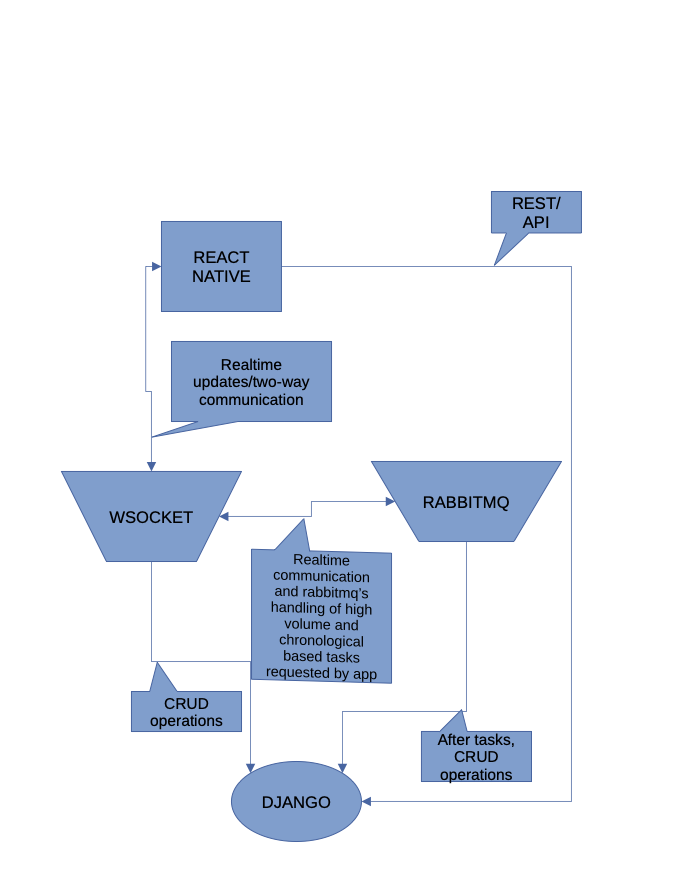
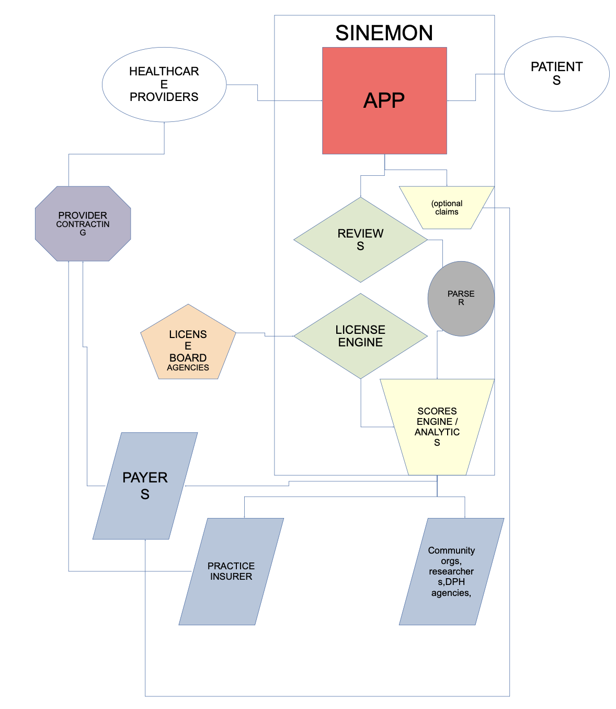

# Sinemon (si · nuh · muhn)

## ✅ Supported Versions


| Tool                | Version | Managed By                               |
| ------------------- | ------- | ---------------------------------------- |
| **Node.js**         | 20.17.0 | [`Volta`](https://volta.sh)                |
| **npm**             | 11.1.0  | Volta                                    |
| **Python**          | 3.9     | [`Docker`](https://www.docker.com/get-started/)                                   |
| **PostgreSQL**      | 17      | Docker                                   |
| **RabbitMQ**        | 3.\*    | Docker (`rabbitmq:3-management`)         |
| **Django**          | 3.2.12  | [`requirements.txt`](/SinemonBackend/requirements.txt) |
| **python-socketio** | 5.13.0  | requirements.txt |
| **pika**            | 1.3.2   | requirements.txt |

## 📱 Platform Support

| Platform | Supported |
|----------|-----------|
| iOS      | ✅         |
| Android  | ❌         |

> This project is designed specifically for iOS devices. Android is not supported yet.


#### Local Installation of Sinemon APP
##### **Clone the Repository** 
```
sh

git clone https://github.com/Klementine-Co/Sinemon.git
cd Sinemon
```
## 🧱 App Architecture  





---

##### Using the File "Sinemon Project.docx", the below README was summarized with help of AI.
# 🩺 Sinemon: Reimagining Non-Emergency Healthcare
**Version:** 1  
**Prepared by:** Caelon Queen  
**Date:** November 22, 2020  
---


## 📌 Executive Summary

Sinemon is a healthcare technology platform built to transform **non-emergency care access** for both patients and providers. It includes:

- A **user-facing app** for navigating healthcare and wellness options
- A **provider-facing app** for efficient patient engagement and practice management

---

## 🎯 Objectives

- Reduce non-emergency emergency room (ER) visits
- Improve healthcare equity and care quality
- Lower the cost-to-quality ratio for patients
- Empower healthcare provider ownership
- Enhance access through flexible scheduling and self-service
- Increase data-driven accountability and health system transparency

---

## 🛠️ Solution Highlights

| Goal | Strategy | Measure of Success |
|------|----------|--------------------|
| Reduce ER use for non-emergencies | Scheduling software + provider lookup | Lower ER use in both high- and low-income areas |
| Lower patient costs | Show analytics before visits | Fewer complaints, higher satisfaction |
| Lower provider overhead | Offer risk data to insurers | Reduced premiums, better provider salaries |
| Increase access | Support 24/7 self-scheduled care | More late-hour practices using platform |
| Expand healthcare workforce | Provide backend/startup tools | More provider ownership and community clinics |
| Monitor medication safety | Generate prescription reaction analytics | Identify prescriber-based risk trends |
| Become a wellness hub | Central health and wellness info line | Higher traffic to vetted resources |

---

## 🏥 Ecosystem Diagram





---

## 📊 Market Potential

### 📌 Market Segments

- **Public/Private Insurance:**  
  By diverting non-emergency visits, Sinemon saves insurers and providers billions in care costs.

- **Medical Practices:**  
  With better scheduling and reduced malpractice risk, Sinemon saves ~$2,640/year per physician.

- **Healthcare Technology:**  
  Sinemon's data-driven ecosystem aligns with value-based care models (e.g., Pay-for-Performance).

---

## 💰 Financial Model Roadmap

- Keep provider licenses under **$200/month**
- Follow a **freemium model** for patient users
- Annual data caps based on user age and LTC status:
  - LTC users: 550MB/year
  - Non-LTC, under 65: 300MB/year
  - Non-LTC, 65+: 720MB/year

> The financial model is evolving and open to refinement by collaborators.

---

## 📈 Estimated Impact

- ~60% of ER visits may be diverted → ~$21B in additional cash flow for providers
- ~$60B in potential payer savings
- ~$71M in monthly savings for non-emergency care market
- Potential $536,000/year recurring revenue from base provider licenses

---

## 🤝 Contributing

Contributors can help refine code, financial models, expand analytics capabilities, and improve regulatory tooling. All contributions should align with the mission to support ethical, equitable, and cost-effective healthcare delivery.

---

## ⚖️ License

                                 Apache License
                           Version 2.0, January 2004
                        http://www.apache.org/licenses/

  
